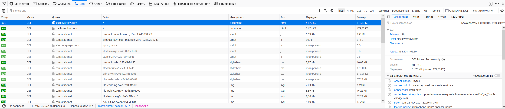

**1. В ответе укажите полученный HTTP код, что он означает?**  
> HTTP/1.1 301 Moved Permanently  
> Код 301 означает, что запрошенный ресурс был на постоянной основе перемещён в новое месторасположение, и указывающий на то, что текущие ссылки, использующие данный URL, должны быть обновлены.  

**2.1 Найдите первый ответ HTTP сервера, откройте вкладку Headers. Укажите в ответе полученный HTTP код.**  
```
scheme: http
host: stackoverflow.com
filename: /
Адрес: 151.101.1.69:80
Состояние: 301 Moved Permanently
Версия: HTTP/1.1
Передано: 51,70 КБ (размер 172,83 КБ)
```
**2.2 Проверьте время загрузки страницы, какой запрос обрабатывался дольше всего?**  
```
scheme: https
host: stackoverflow.com
filename: /
Адрес: 151.101.129.69:443
Состояние: 200 OK
Версия: HTTP/2
Передано: 51,74 КБ (размер 172,83 КБ)
```
```
В очереди: 358 мс Начато: 358 мс Загружено: 592 мс
Тайминг запроса
Заблокировано: 0 мс
Поиск DNS: 1 мс
Соединение: 35 мс
Установка TLS: 65 мс
Отправка: 0 мс
Ожидание: 132 мс
Получение: 0 мс
```
**2.3 Приложите скриншот консоли браузера в ответ.**  
  
