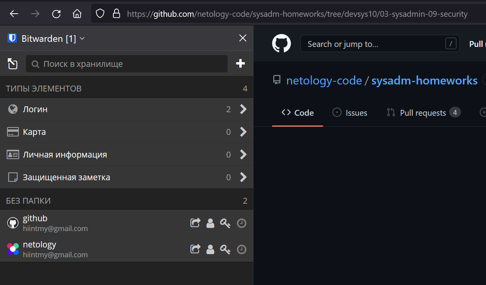
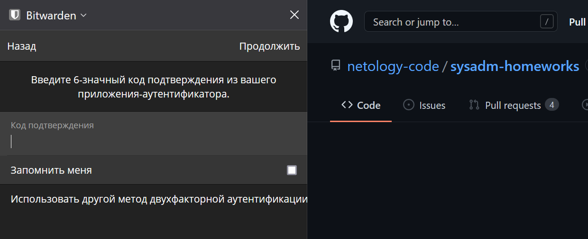
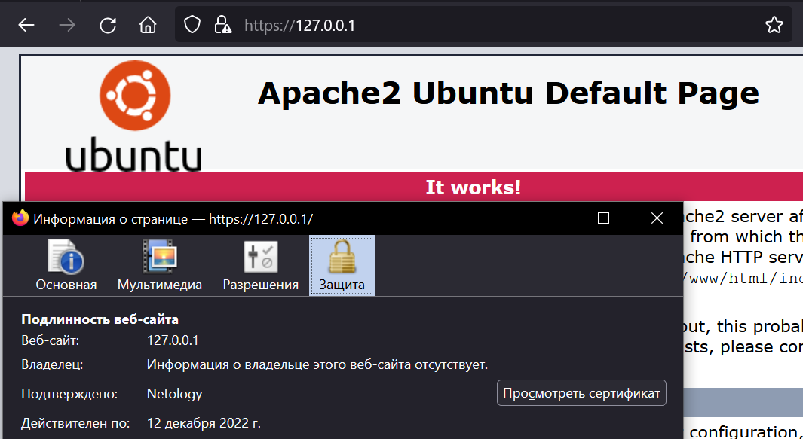
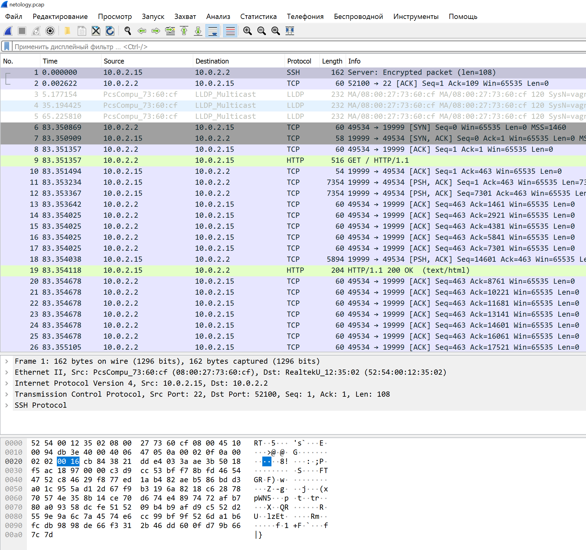

**1. Установите Bitwarden плагин для браузера. Зарегестрируйтесь и сохраните несколько паролей.**  
  

**2. Установите Google authenticator на мобильный телефон. Настройте вход в Bitwarden акаунт через Google authenticator OTP.**  
  

**3. Установите apache2, сгенерируйте самоподписанный сертификат, настройте тестовый сайт для работы по HTTPS.**  
> sudo apt install apache2 -y  
> sudo openssl req -x509 -nodes -days 365 -newkey rsa:2048 -keyout /etc/ssl/private/site.key -out /etc/ssl/certs/site.crt  
> sudo vi /etc/apache2/sites-available/default-ssl.conf  
```
<IfModule mod_ssl.c>
        <VirtualHost _default_:443>
                ServerAdmin admin@netology.ru

                DocumentRoot /var/www/html

                ErrorLog ${APACHE_LOG_DIR}/error.log
                CustomLog ${APACHE_LOG_DIR}/access.log combined

                SSLEngine on

                SSLCertificateFile      /etc/ssl/certs/site.crt
                SSLCertificateKeyFile /etc/ssl/private/site.key

                <FilesMatch "\.(cgi|shtml|phtml|php)$">
                                SSLOptions +StdEnvVars
                </FilesMatch>
                <Directory /usr/lib/cgi-bin>
                                SSLOptions +StdEnvVars
                </Directory>

        </VirtualHost>
</IfModule>                                        
```
> sudo a2enmod ssl  
> sudo a2enmod headers  
> sudo a2ensite default-ssl  
> sudo systemctl restart apache2  

  

**4. Проверьте на TLS уязвимости произвольный сайт в интернете.**  
> ./testssl.sh https://ya.ru/
```
 Testing vulnerabilities

 Heartbleed (CVE-2014-0160)                not vulnerable (OK), no heartbeat extension
 CCS (CVE-2014-0224)                       not vulnerable (OK)
 Ticketbleed (CVE-2016-9244), experiment.  not vulnerable (OK), reply empty
 ROBOT                                     not vulnerable (OK)
 Secure Renegotiation (RFC 5746)           supported (OK)
 Secure Client-Initiated Renegotiation     not vulnerable (OK)
 CRIME, TLS (CVE-2012-4929)                not vulnerable (OK)
 BREACH (CVE-2013-3587)                    potentially NOT ok, "gzip" HTTP compression detected. - only supplied "/" tested
                                           Can be ignored for static pages or if no secrets in the page
 POODLE, SSL (CVE-2014-3566)               not vulnerable (OK), no SSLv3 support
 TLS_FALLBACK_SCSV (RFC 7507)              Check failed, unexpected result , run testssl.sh -Z --debug=1 and look at /tmp/testssl.tuEf8W/*tls_fallback_scsv.txt
 SWEET32 (CVE-2016-2183, CVE-2016-6329)    VULNERABLE, uses 64 bit block ciphers
 FREAK (CVE-2015-0204)                     not vulnerable (OK)
 DROWN (CVE-2016-0800, CVE-2016-0703)      not vulnerable on this host and port (OK)
                                           make sure you don't use this certificate elsewhere with SSLv2 enabled services
                                           https://censys.io/ipv4?q=26EB381642B07A05F7CA935101FC6492F91F7F0721995A8E577EDFB6723EBD1F could help you to find out
 LOGJAM (CVE-2015-4000), experimental      not vulnerable (OK): no DH EXPORT ciphers, no DH key detected with <= TLS 1.2
 BEAST (CVE-2011-3389)                     TLS1: ECDHE-RSA-AES128-SHA AES128-SHA DES-CBC3-SHA
                                           VULNERABLE -- but also supports higher protocols  TLSv1.1 TLSv1.2 (likely mitigated)
 LUCKY13 (CVE-2013-0169), experimental     potentially VULNERABLE, uses cipher block chaining (CBC) ciphers with TLS. Check patches
 Winshock (CVE-2014-6321), experimental    not vulnerable (OK)
 RC4 (CVE-2013-2566, CVE-2015-2808)        no RC4 ciphers detected (OK)
```

**5. Установите на Ubuntu ssh сервер, сгенерируйте новый приватный ключ. 
Скопируйте свой публичный ключ на другой сервер. Подключитесь к серверу по SSH-ключу.**  
> sudo apt install openssh-server -y  
> systemctl start sshd  
> ssh-keygen -t rsa  
> ssh-copy-id user@10.0.2.2  
> ssh user@10.0.2.2  

**6. Переименуйте файлы ключей из задания 5. 
Настройте файл конфигурации SSH клиента, так чтобы вход на удаленный сервер осуществлялся по имени сервера.**  
> mv ~/.ssh/id_rsa ~/.ssh/id_rsa_renamed  
> vi ~/.ssh/config  
```
Host comp
        HostName 10.0.2.2
        IdentityFile ~/.ssh/id_rsa_renamed
        User user
```
> ssh user@comp  

**7. Соберите дамп трафика утилитой tcpdump в формате pcap, 100 пакетов. Откройте файл pcap в Wireshark.**  
> sudo tcpdump -c 100 -w netology.pcap  
>   
