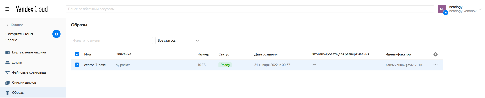
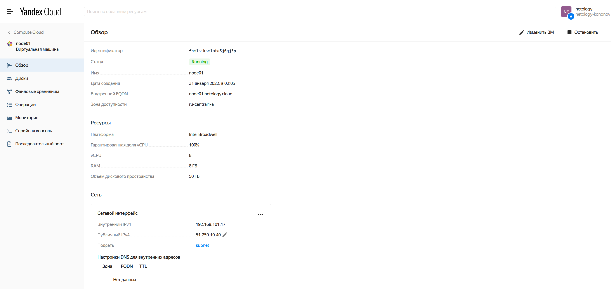
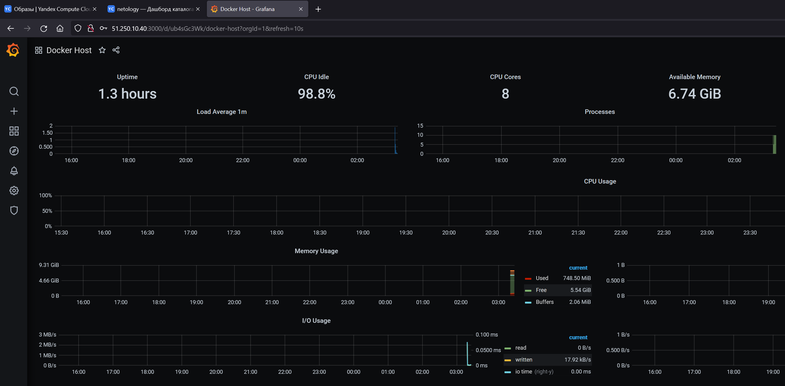
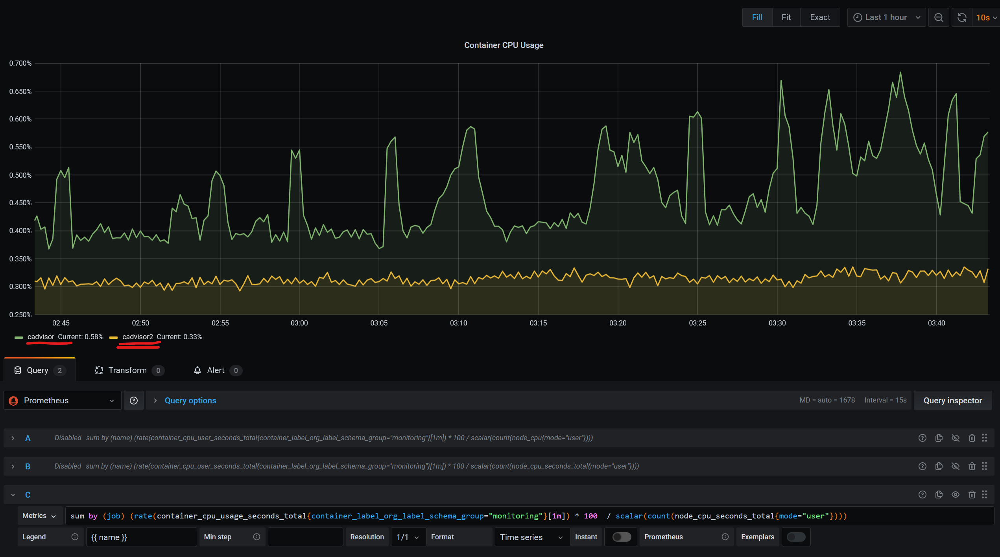

**1. Создать собственный образ операционной системы с помощью Packer.**  
  

**2. Создать вашу первую виртуальную машину в Яндекс.Облаке.**  
  

**3. Создать ваш первый готовый к боевой эксплуатации компонент мониторинга, состоящий из стека микросервисов.**  
  

**4. Создать вторую ВМ и подключить её к мониторингу развёрнутому на первом сервере.**  
  