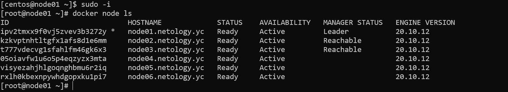
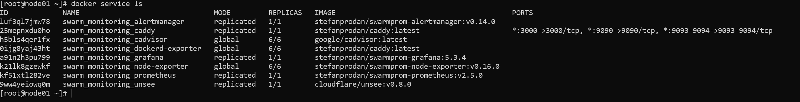

**1. Дайте письменые ответы на следующие вопросы:**  
      
| Вопрос                                                                               | Ответ                                                                                                                                                                                                                                                                                              |
|--------------------------------------------------------------------------------------|----------------------------------------------------------------------------------------------------------------------------------------------------------------------------------------------------------------------------------------------------------------------------------------------------|
| В чём отличие режимов работы сервисов в Docker Swarm кластере: replication и global? | Если сервис работает в режиме global, этот сервис в обязательном порядке запускается на каждой ноде кластера (в том числе на новых добавляемых). Если сервис запущен в режиме replication, он запускается в количестве, указанном в коефигурации кластера.                                         |
| Какой алгоритм выбора лидера используется в Docker Swarm кластере?                   | Кластер использует алгоритм Raft консенсуса. Условием кворума в этом алгоритме является доступность (N/2)+1 участников.                                                                                                                                                                            |
| Что такое Overlay Network?                                                           | Overlay сетью называется сеть, работающая поверх существующей сети. В контексте Docker Swarm - это сеть (сети), объединяющая ноды кластера, образуя внутрикластерную локальную сеть (сети). Сеть по умолчанию (ingress) отвечает за подключение к ресурсам кластера извне и балансировку нагрузки. |

**2. Предоставить скриншот из терминала (консоли) с выводом команды docker node ls**  
  

**3. Предоставить скриншот из терминала (консоли) с выводом команды docker service ls**  

**4. Выполнить на лидере Docker Swarm кластера команду docker swarm update --autolock=true  
Дать письменное описание её функционала, что она делает и зачем она нужна.**  

> Команда docker swarm update --autolock=true включает на работающем кластере опцию autolock, которая препятствует  
> неконтролируемому запуску (перезапуску) кластера docker на хостах кластера. Для запуска кластера необходимо ввести  
> токен, распечатывающий кластер. Эта одна из опций безопасности, позволяющая защитить ключи шифрования, используемые  
> для шифрования Raft логов и конфигурации кластера на хостах с ролью менеджер.