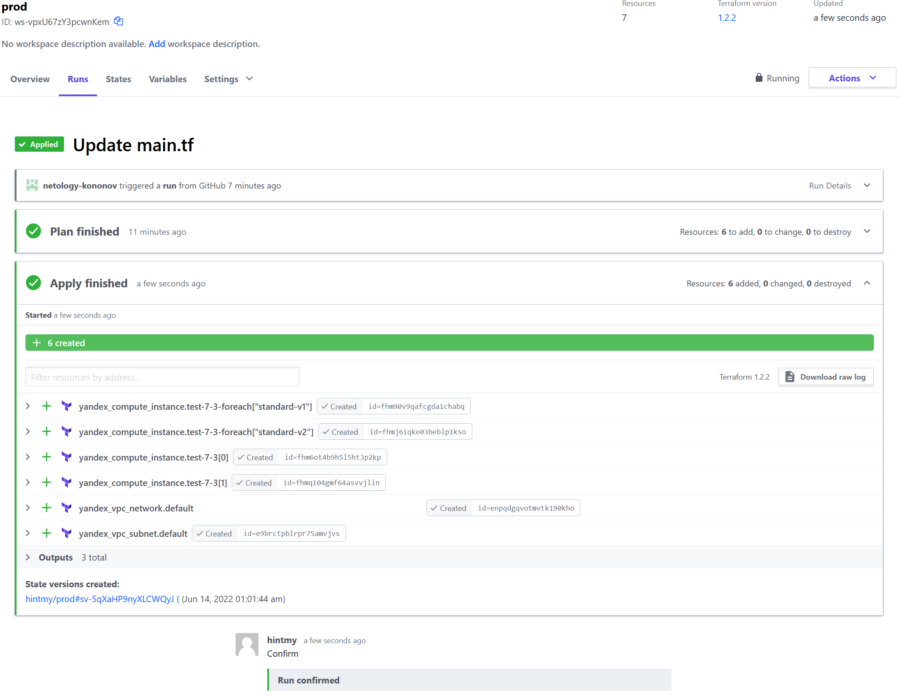

**1. Приложите снимок экрана с успешным применением конфигурации.**  
  

**2. Приложите ссылку на файлы server.yaml и atlantis.yaml.**  
> https://github.com/netology-kononov/devops-netology/blob/main/atlantis/server.yaml  
> https://github.com/netology-kononov/devops-netology/blob/main/atlantis/atlantis.yaml  

**3. Приложите ссылку на созданный блок конфигураций.**  
> В связи с недоступностью aws, использовался локальный предоставленный лектором модуль для создания инстансов в yc  
> https://github.com/netology-kononov/devops-netology/tree/main/tf-modules
