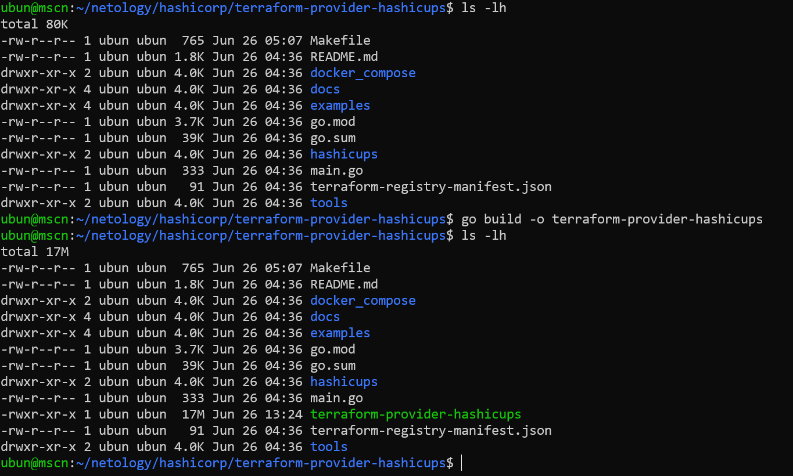

**1.1 Найдите, где перечислены все доступные resource и data_source, приложите ссылку на эти строки в коде на гитхабе.**  
> data_source map  
> https://github.com/hashicorp/terraform-provider-aws/blob/e624f5ee38669a68a545acdca21d26314472e03c/internal/provider/provider.go#L425  
> resource map  
> https://github.com/hashicorp/terraform-provider-aws/blob/e624f5ee38669a68a545acdca21d26314472e03c/internal/provider/provider.go#L909

**1.2 Для создания очереди сообщений SQS используется ресурс aws_sqs_queue у которого есть параметр name.**  

- С каким другим параметром конфликтует name?  
> name_prefix  
> https://github.com/hashicorp/terraform-provider-aws/blob/e624f5ee38669a68a545acdca21d26314472e03c/internal/service/sqs/queue.go#L87
- Какая максимальная длина имени?  
> 80 символов  
- Какому регулярному выражению должно подчиняться имя?  
> ^[a-zA-Z0-9_-]{1,75}\.fifo$  
> https://github.com/hashicorp/terraform-provider-aws/blob/e624f5ee38669a68a545acdca21d26314472e03c/internal/service/sqs/queue.go#L425  
> ^[a-zA-Z0-9_-]{1,80}$  
> https://github.com/hashicorp/terraform-provider-aws/blob/e624f5ee38669a68a545acdca21d26314472e03c/internal/service/sqs/queue.go#L427  

*Я был бы благодарен, если бы преподаватели объяснили, как происходит проверка параметра name, когда и почему вызывается функция resourceQueueCustomizeDiff*  

**2.2 В виде результата приложение ссылку на исходный код.**  
> Компилировался код демонстрационного провайдера  
> https://github.com/hashicorp/terraform-provider-hashicups

**2.3 Попробуйте скомпилировать провайдер, если получится то приложите снимок экрана с командой и результатом компиляции.**  
  