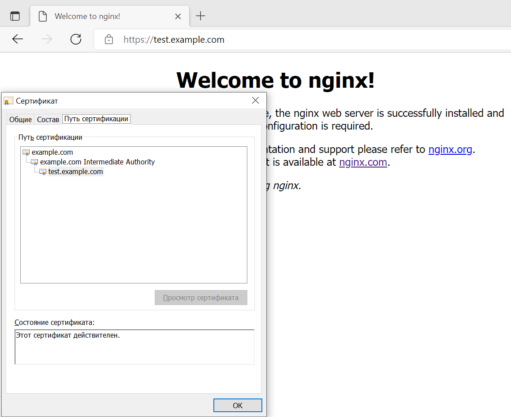

**1. Создайте виртуальную машину Linux.**  
> Использовался конфигурационный файл Vagrant:
```
Vagrant.configure("2") do |config|
  config.vm.hostname = "vagrant-term"
  config.vm.box = "bento/ubuntu-20.04"
  config.vm.network "forwarded_port", guest: 80, host: 80
  config.vm.network "forwarded_port", guest: 443, host: 443
end
```
> vagrant up

**2. Установите ufw и разрешите к этой машине сессии на порты 22 и 443, при этом трафик на интерфейсе localhost (lo) 
должен ходить свободно на все порты.**  
> ufw allow ssh  
> ufw allow https  
> ufw allow in on lo to any  
> ufw default deny incoming  
> ufw default allow outgoing  
> ufw enable  
```commandline
# ufw status verbose
Status: active
Logging: on (low)
Default: deny (incoming), allow (outgoing), disabled (routed)
New profiles: skip

To                         Action      From
--                         ------      ----
22/tcp                     ALLOW IN    Anywhere
443/tcp                    ALLOW IN    Anywhere
Anywhere on lo             ALLOW IN    Anywhere
22/tcp (v6)                ALLOW IN    Anywhere (v6)
443/tcp (v6)               ALLOW IN    Anywhere (v6)
Anywhere (v6) on lo        ALLOW IN    Anywhere (v6)
```

**3. Установите hashicorp vault.**  
> curl -fsSL https://apt.releases.hashicorp.com/gpg | sudo apt-key add -  
> apt-add-repository "deb [arch=amd64] https://apt.releases.hashicorp.com $(lsb_release -cs) main"  
> apt-get update && apt-get install vault  

**4. Cоздайте центр сертификации по инструкции и выпустите сертификат для использования его в настройке веб-сервера 
nginx (срок жизни сертификата - месяц).**  
> В связи с замечанием Руслана Жданова в Telegram-чате, УЦ выпускался не согласно предложенной в ДЗ инструкции, 
> а на Vualt запущенном в non-dev режиме. Для это был создан файл конфигурации сервера:  
> vi /etc/vault.d/vault.hcl  
```
ui = true
storage "file" {
  path = "/opt/vault/data"
}
listener "tcp" {
  address       = "0.0.0.0:8200"
  tls_disable = "true"
}
api_addr = "http://127.0.0.1:8200"
cluster_addr = "https://127.0.0.1:8201"
``` 
> Создан unit-файл для systemd:  
> vi /etc/systemd/system/vault.service  
```
[Unit]
Description="HashiCorp Vault - A tool for managing secrets"
Documentation=https://www.vaultproject.io/docs/
Requires=network-online.target
After=network-online.target
ConditionFileNotEmpty=/etc/vault.d/vault.hcl
StartLimitIntervalSec=60
StartLimitBurst=3

[Service]
User=vault
Group=vault
ProtectSystem=full
ProtectHome=read-only
PrivateTmp=yes
PrivateDevices=yes
SecureBits=keep-caps
NoNewPrivileges=yes
AmbientCapabilities=CAP_IPC_LOCK
ExecStart=/usr/bin/vault server -config=/etc/vault.d/vault.hcl
ExecReload=/bin/kill --signal HUP $MAINPID
KillMode=process
KillSignal=SIGINT
Restart=on-failure
RestartSec=5
TimeoutStopSec=30
LimitNOFILE=65536
LimitMEMLOCK=infinity

[Install]
WantedBy=multi-user.target
```
> Запущен и добавлен в автозагрузку сервис vault:
```commandline
systemctl daemon-reload
systemctl enable vault
systemctl start vault
```
> Инициирован Vault с одним ключом, так как предполагается, что Vault будет распечатываться автоматически и ключ будет 
> храниться локально. Этот сценарий небезопасен, но именно такое решение было запрошено в Telegram чате (см. выше).
```commandline
export VAULT_ADDR='http://127.0.0.1:8200'  
vault operator init -key-shares=1 -key-threshold=1  
```
> Модифицирован unit-файл так, чтобы он автоматически распечатывал инициированный Vault, в раздел [Service] добавлена строка:
```
ExecStartPost=/bin/bash -c "sleep 2; export VAULT_ADDR=http://127.0.0.1:8200; /usr/bin/vault operator unseal <unseal-key>"
```
> Перезапущен сервис vault с автоматическим распечатыванием:
```commandline
systemctl daemon-reload
systemctl restart vault
```
> Согласно инструкции созданы корневой УЦ с самоподписанным сертификатом для домена example.com и промежуточный УЦ:
```commandline
export VAULT_TOKEN=<root-key>

vault secrets enable pki
vault secrets tune -max-lease-ttl=87600h pki
vault write -field=certificate pki/root/generate/internal common_name="example.com" ttl=87600h > CA_cert.crt
vault write pki/config/urls issuing_certificates="$VAULT_ADDR/v1/pki/ca" crl_distribution_points="$VAULT_ADDR/v1/pki/crl"

vault secrets enable -path=pki_int pki
vault secrets tune -max-lease-ttl=43800h pki_int
vault write -format=json pki_int/intermediate/generate/internal common_name="example.com Intermediate Authority" | jq -r '.data.csr' > pki_intermediate.csr
vault write -format=json pki/root/sign-intermediate csr=@pki_intermediate.csr format=pem_bundle ttl="43800h" | jq -r '.data.certificate' > intermediate.cert.pem
vault write pki_int/intermediate/set-signed certificate=@intermediate.cert.pem

vault write pki_int/roles/example-dot-com allowed_domains="example.com" allow_subdomains=true max_ttl="720h"
```
> Создан сертификат для сайта test.example.com:
```commandline
vault write pki_int/issue/example-dot-com common_name="test.example.com" ttl="720h"
```

**5. Установите корневой сертификат созданного центра сертификации в доверенные в хостовой системе.**  
> Добавлен сертификат УЦ в контейнер доверенных корневых сертификатов компьютера Windows (PowerShell):
```
Import-Certificate -FilePath "C:\_tmp\CA_cert.crt" -CertStoreLocation Cert:\LocalMachine\Root
```

**6. Установите nginx.**  
```
apt install nginx -y
```

**7. По инструкции настройте nginx на https, используя ранее подготовленный сертификат.**  
> Полученные сертификаты и закрытый ключ сохранены в файл /etc/ssl/test.example.com.cert.  
> В файл конфигурации дефолтного сайта сервера nginx (раздел server) добавлены строки:  
> vi /etc/nginx/sites-enabled/default
```
listen 443 ssl default_server;
ssl_certificate     /etc/ssl/test.example.com.cert;
ssl_certificate_key /etc/ssl/test.example.com.cert;
```

**8. Откройте в браузере на хосте https адрес страницы, которую обслуживает сервер nginx.**  
  

**9. Создайте скрипт, который будет генерировать новый сертификат в vault.**  
> vi /etc/ssl/test.example.com.cert.sh  
> chmod +x /etc/ssl/test.example.com.cert.sh  
```commandline
#!/usr/bin/env bash

export VAULT_ADDR=http://127.0.0.1:8200
export VAULT_TOKEN=<site-key>

REQUEST=$(vault write pki_int/issue/example-dot-com common_name="test.example.com" ttl="720h" --format=json)
SITE_CRT=$(echo $REQUEST | jq .data.certificate | tr -d \")
ISS_CA=$(echo $REQUEST | jq .data.issuing_ca | tr -d \")
SITE_KEY=$(echo $REQUEST | jq .data.private_key | tr -d \")
CERT_FILE=${SITE_CRT}\\n${ISS_CA}\\n${SITE_KEY}
echo -e $CERT_FILE > /etc/ssl/test.example.com.cert
systemctl restart nginx
```

**10. Поместите скрипт в crontab, чтобы сертификат обновлялся какого-то числа каждого месяца в удобное для вас время.**  
> Сертификат будет обновляться в 22:25 7-го числа каждого месяца  
> crontab -e  
> Добавлена новая строка:  
> 25 22 7 * * /etc/ssl/test.example.com.cert.sh > /dev/null 2>&1
> Журнал выполнения задачи crontab (/var/log/syslog):
```
Jan  7 22:25:01 vagrant-term CRON[1224]: (root) CMD (/etc/ssl/test.example.com.cert.sh > /dev/null 2>&1)
Jan  7 22:25:02 vagrant-term systemd[1]: Stopping A high performance web server and a reverse proxy server...
Jan  7 22:25:02 vagrant-term systemd[1]: nginx.service: Succeeded.
Jan  7 22:25:02 vagrant-term systemd[1]: Stopped A high performance web server and a reverse proxy server.
Jan  7 22:25:02 vagrant-term systemd[1]: Starting A high performance web server and a reverse proxy server...
Jan  7 22:25:02 vagrant-term systemd[1]: Started A high performance web server and a reverse proxy server.
```
